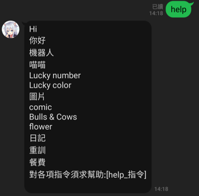
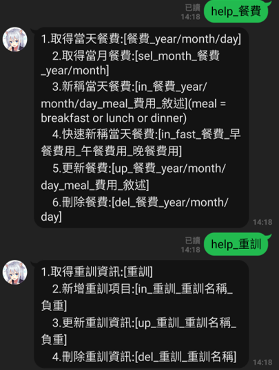
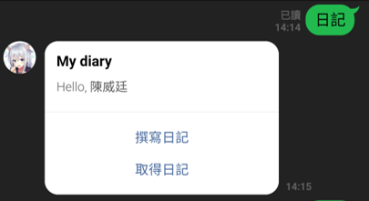
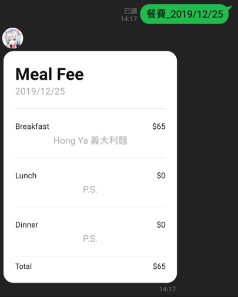
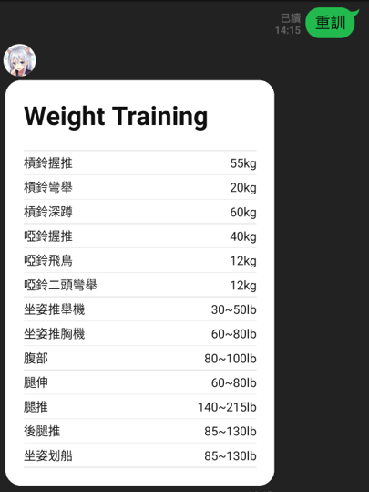

LineBot
=========

專案開發時間
--------------

2019/09/28 ~ Now

摘要
------

此程式為個人用，就不方便公布。

Linebot主要在生活中，為了事情做紀錄和方便所做的設計。

Program summary
-----------------
* Back-End : Heroku
* Database : Postgresql

* 功能指令
* 

* 指令提示
* 

  * 介紹主要大功能

* 日記撰寫
* 

* 餐費紀錄
* 

* 重量訓練紀錄
* 
